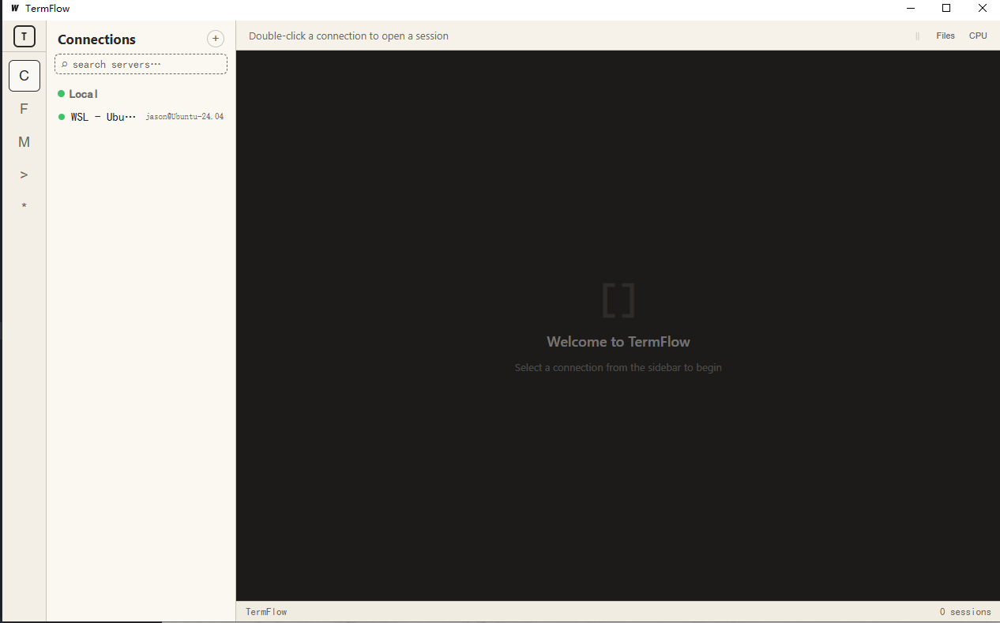
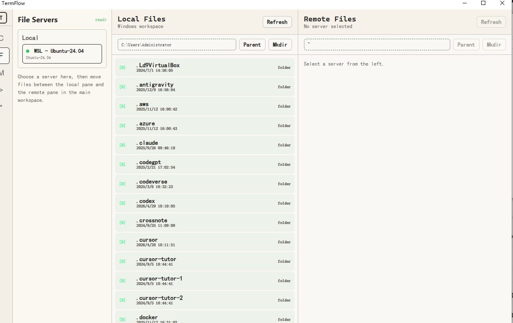
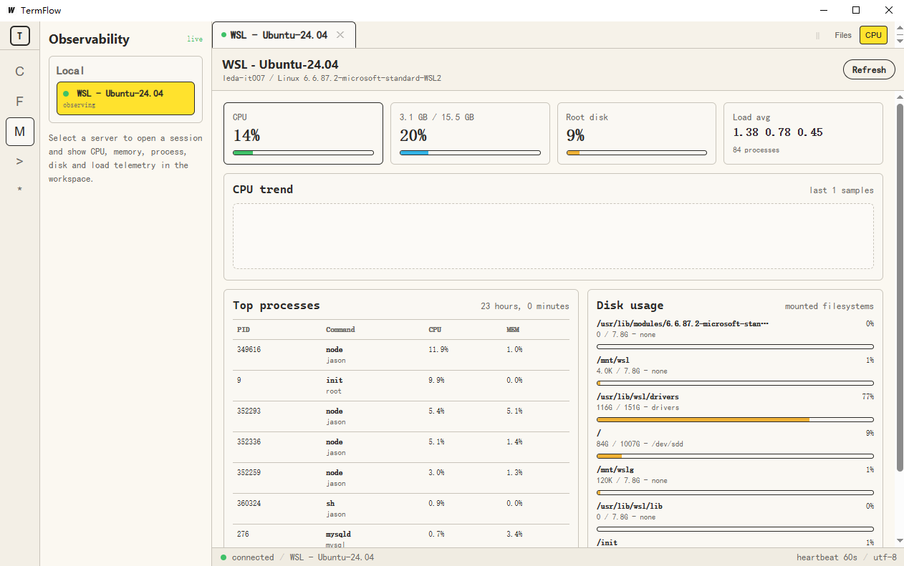
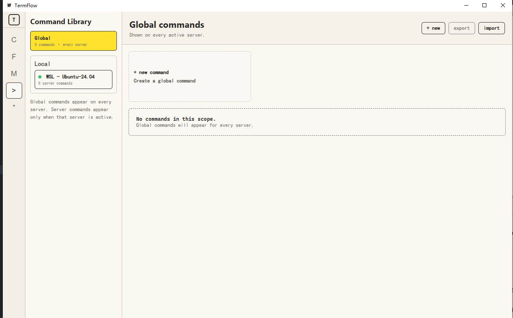
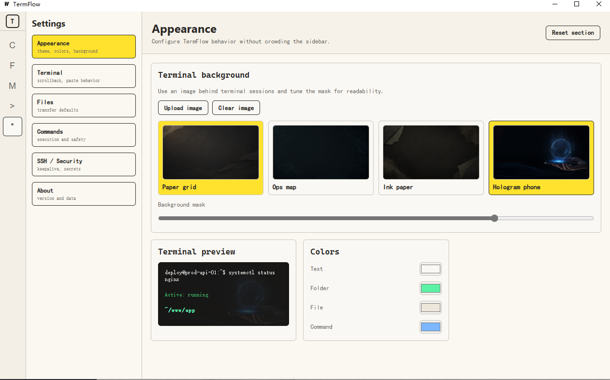

# TermFlow

TermFlow is a Wails v2 desktop terminal manager built with Go and Vue 3. It provides a focused workspace for SSH and WSL sessions, combining terminal tabs, connection management, remote file browsing, quick commands, observability, and appearance settings in one native Windows app.

The project is designed for developers and operators who frequently move between local WSL environments and remote Linux servers, and want a lightweight desktop tool instead of a browser-heavy control panel.

## Features

- SSH and WSL connection management
- Multi-session terminal tabs powered by xterm.js
- Local and remote file browsing
- Remote upload and download workflows
- Quick command library with global and server-scoped commands
- CPU, memory, disk, process, and load monitoring for active sessions
- Configurable terminal backgrounds, colors, and behavior
- SQLite-backed local storage
- Native desktop packaging through Wails

## Screenshots

### Terminal Workspace

Manage SSH and WSL connections from the sidebar and open sessions in terminal tabs.



### File Manager

Browse local files and remote server files side by side.



### Observability

Inspect CPU, memory, disk usage, load average, uptime, and top processes for the active session.



### Command Library

Create reusable global commands or commands scoped to a specific server.



### Settings

Tune terminal appearance, backgrounds, colors, file transfer behavior, command options, and security settings.



## Tech Stack

- Wails v2
- Go
- Vue 3
- TypeScript
- Vite
- xterm.js
- ECharts
- SQLite

## Project Structure

```text
.
+-- app.go                  # Wails backend methods exposed to the frontend
+-- main.go                 # Wails application entrypoint
+-- internal/
|   +-- ssh/                # SSH session management
|   +-- store/              # SQLite storage and migrations
|   +-- termexec/           # Cross-platform process helpers
|   +-- wsl/                # WSL session support
+-- frontend/
|   +-- src/                # Vue application source
|   +-- wailsjs/            # Generated Wails bindings
+-- docs/
|   +-- images/             # README screenshots
+-- build/                  # Wails build assets
```

## Development

Install frontend dependencies:

```powershell
cd frontend
npm install
```

Run the full desktop app in development mode:

```powershell
wails dev
```

Run only the frontend development server:

```powershell
cd frontend
npm run dev
```

## Build

Create a production desktop build:

```powershell
wails build
```

The Windows executable is generated under:

```text
build/bin/TermFlow.exe
```

## GitHub Actions

This repository includes a GitHub Actions workflow at `.github/workflows/build.yml`.

On pushes to `main` or `master`, pull requests, tags starting with `v`, or manual runs from the Actions tab, GitHub builds:

- `TermFlow-windows-amd64.zip`, containing the Windows executable
- `TermFlow-macos.zip`, containing the macOS app bundle

Download the generated files from the workflow run artifacts in the GitHub Actions page.

## Test

Run Go package tests:

```powershell
go test ./...
```

Build the frontend bundle:

```powershell
cd frontend
npm run build
```

## Repository

```text
git@github.com:jasonyang6688/go-termflow.git
```

## License

No license has been declared yet.
